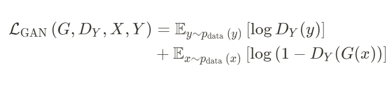
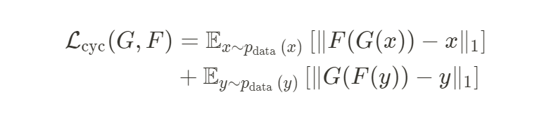
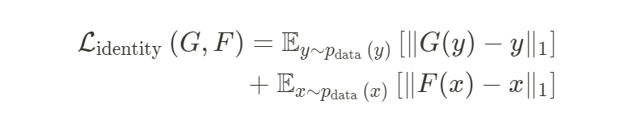
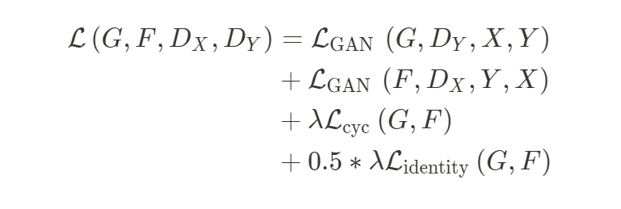

# Cycle GAN 

## Model Architecture


## Result


## Loss Function
**Adverarial Loss**


**Cycle Consistency Loss**


**Identity Loss**


**Full Objective**


## Dataset
```
./download_dataset monet2photo
```

## Reference
[Unpaired Image-to-Image Translation using Cycle-Consistent Adversarial Networks](https://arxiv.org/pdf/1703.10593.pdf)
