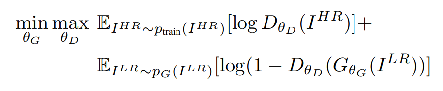
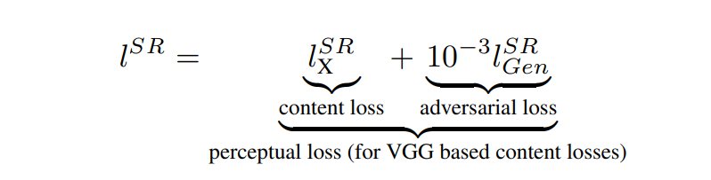
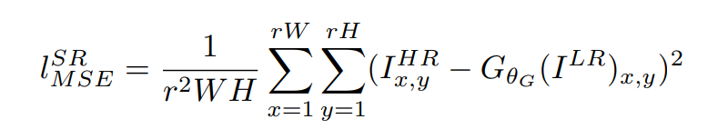
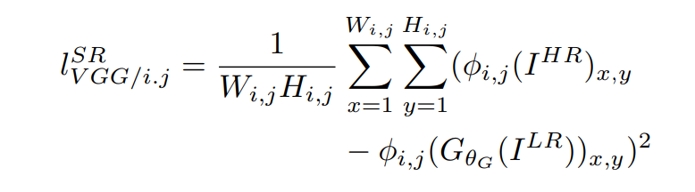
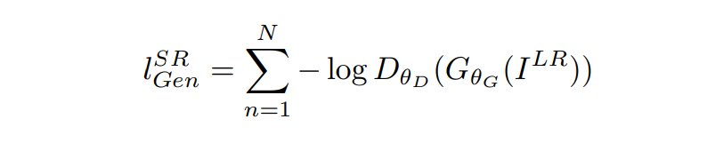

# Super Resolution GAN 

## Model Architecture

## Result

## Loss Function
### Discriminator Loss

### Perceptual Loss

### Content Loss
**MSE**

**VGG**

### Generator Loss

## Reference
[Photo-Realistic Single Image Super-Resolution Using a Generative Adversarial Network](https://arxiv.org/pdf/1609.04802.pdf)
