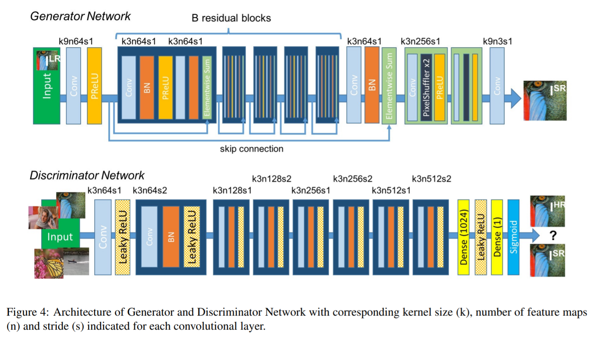

# Super Resolution GAN 

## Model Architecture

## Result

## Loss Function
### Adverarial Loss

### Perceptual Loss

**Content Loss**

**Adversarial loss**

## Reference
[Photo-Realistic Single Image Super-Resolution Using a Generative Adversarial Network](https://arxiv.org/pdf/1609.04802.pdf)
