# Star GAN 

## Model Architecture
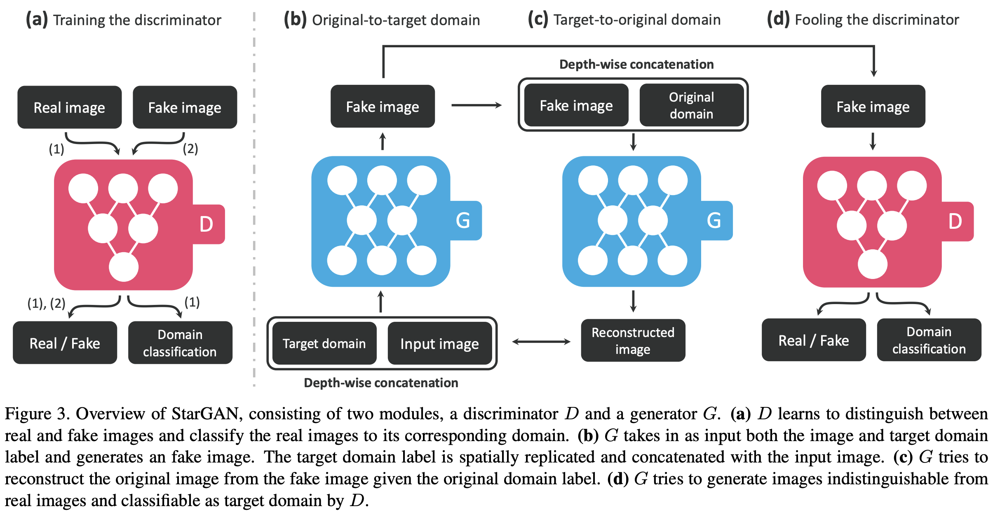

## Loss Function
### Adverarial Loss
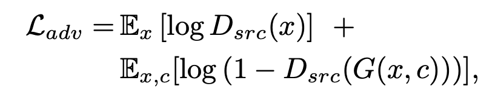

### Reconstruction Loss 
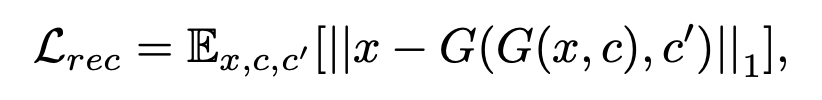

### Domain Classification Loss 

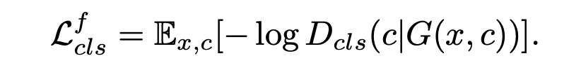

### Full Objective
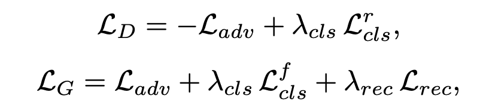

## Result
| Input | Blond Hair || Input | Black Hair || Input | Brown_Hair || Input | Aged || Input | Gender |
|---|---|---|---|---|---|---|---|---|---|---|---|---|---|
|  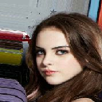 | 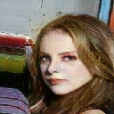 ||  | 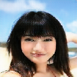 || 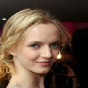 | 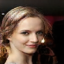 ||  |  || 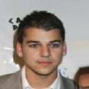 | 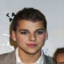 |
|  | 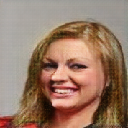 || 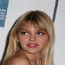 | 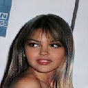 || 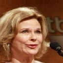 | 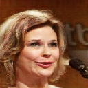 ||  | 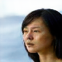 || 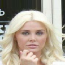 | 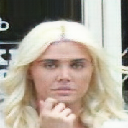 |
| 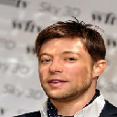 |  || 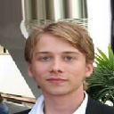 | 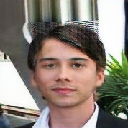 ||  |  ||  | 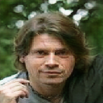 || 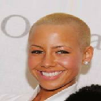 | 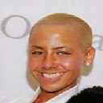 |


## Dataset
```
./download_dataset monet2photo
```

## Reference
[StarGAN: Unified Generative Adversarial Networks for Multi-Domain Image-to-Image Translation](https://arxiv.org/pdf/1711.09020.pdf)
